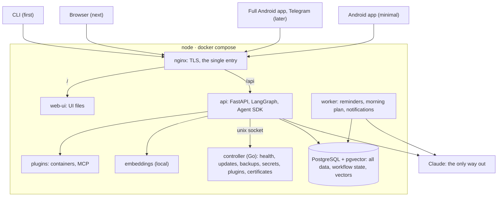

# Architecture

A node is a set of containers in docker compose. There is one way in, through
nginx, and only requests to Claude leave the node. The cluster, Android and
Telegram come later and fit into the same picture.

## Components

| Component | Repository | What it does |
|---|---|---|
| nginx | stock image, config in `titan-node` | The single entry and TLS ([decisions #17, #18, #19](../decisions/README.md#register)): `/` serves the UI, `/api` proxies to the API; security headers; SSE without buffering |
| web-ui | `titan-web` | An image with the UI files only (`FROM scratch`); nginx mounts it read-only |
| api | `titan-backend` | HTTP API for every client; a chat turn is a LangGraph graph running the Agent SDK with tools; autonomy policy and audit log |
| worker | `titan-backend` | Background work: firing reminders, the morning plan and replanning, note indexing |
| controller | `titan-node` | Service health, updates and rollback, backups, secrets, running plugins, certificates; later the cluster. No network listener: the API calls it over a Unix socket ([decision #78](../decisions/README.md#register)) |
| plugins | their own | Containers with a manifest run by the controller, or a TITAN agent on another machine that connects out to the node; the API calls their tools over MCP; they reach data only through the API; confidential values can be replaced with placeholders before leaving the plugin's machine ([plugins on other machines](../decisions/README.md#plugins-on-other-machines-21-22)) |
| db | stock image | PostgreSQL with pgvector: all data, LangGraph workflow state, vectors |
| embeddings | stock image | A local model: text → vector for search by meaning |

## The three main flows

Together these three paths touch almost every component and almost every
hard problem in the system.

### A chat turn

"Remind me tomorrow at 9 to buy milk":

1. The client posts the message to `POST /api/v1/chat/threads/{id}/messages`
   and keeps the SSE stream open.
2. The API stores the message and starts the chat-turn graph: thread history,
   system prompt, tool list.
3. The Agent SDK asks Claude; reply text streams to the client as it comes.
4. Claude decides to call `create_reminder`. The policy hook runs before the
   call: class `write-internal`, mode `auto-undo` → run it, and the reply
   shows an Undo button.
5. The tool writes the reminder; the post-call hook writes an audit entry with
   the way to undo it.
6. Claude gets the result and finishes the reply; the API stores the reply and
   the token usage, and the stream closes.

### An approval

"Delete the project Old receipts":

1. At step 4 the hook sees class `destructive` and mode confirm: the call does
   not run; it is stored as an approval request that expires in 24 hours.
2. The agent is told the call awaits approval and says so; the client shows
   a card, and the Android app shows a notification.
3. The owner taps Approve anywhere: in chat, on the web, on the phone. The
   API runs the stored call exactly as approved, without the agent, and adds
   the result to the thread and the log.
4. Reject or expiry cancels the call; the log keeps a record.

### A reminder fires

1. Every few seconds the worker looks for reminders whose time has come.
2. In one transaction it changes the status and creates a notification whose
   id is derived from the reminder and the time, so a second firing cannot
   create a duplicate. A repeating reminder moves to its next occurrence.
3. The API writes the notification into the device stream of every phone
   the user has; the Android app shows it with Snooze and Done
   ([decisions #14, #23](../decisions/README.md#register)). A phone that was
   offline asks for everything it missed when it reconnects.

## Repositories

| Repository | Language | Contents |
|---|---|---|
| `titan-shared` | — | Product docs, architecture, decisions, development rules, API contracts, design tokens; a submodule `shared/` in every other repository except `titan` |
| `titan-node` | Go | Controller, compose file, nginx config, node install and update |
| `titan-backend` | Python | api, worker, built-in tools, CLI |
| `titan` | — | Product releases: a manifest per TITAN version pinning the tested versions and digests of every image; release notes; the controller updates a node to a manifest |
| `titan-web` | TypeScript | Web UI; an image with the files only |
| `titan-android` | Kotlin | Android app (later) |
| `titan-agent` | — | The agent that hosts plugins on another machine and connects out to the node (later, [decision #80](../decisions/README.md#register)) |
